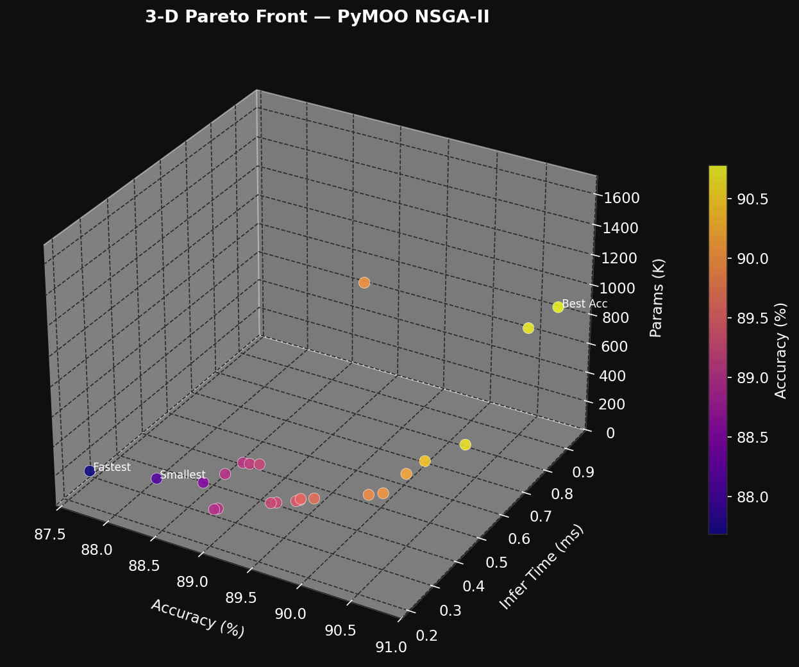
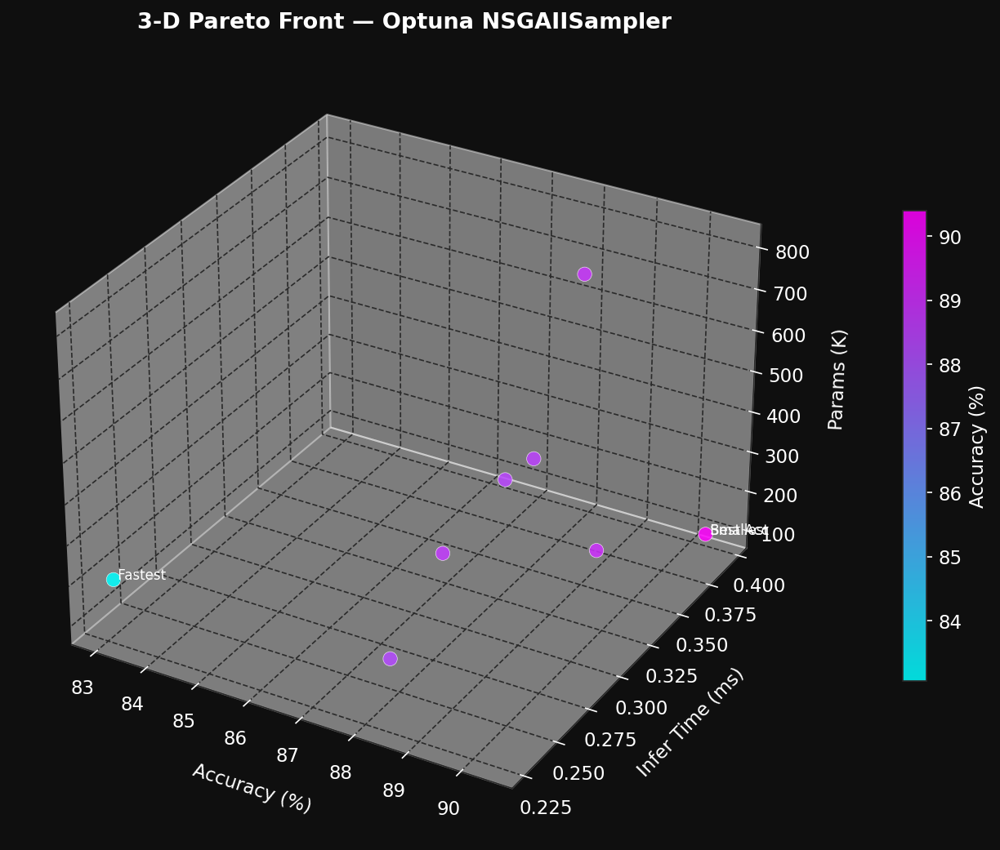
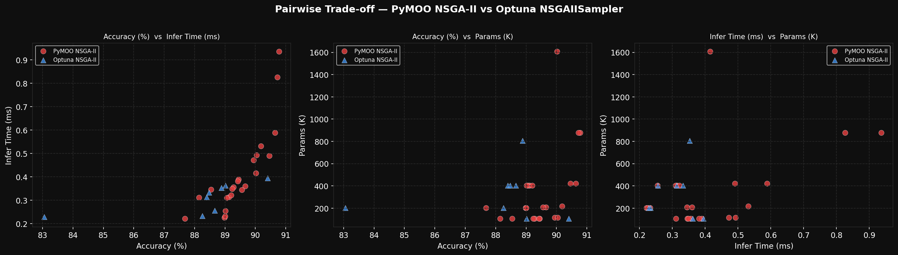
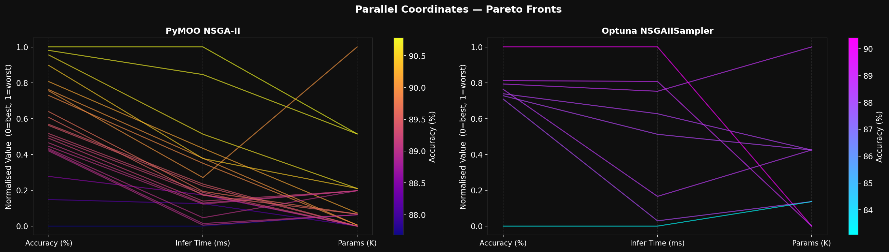
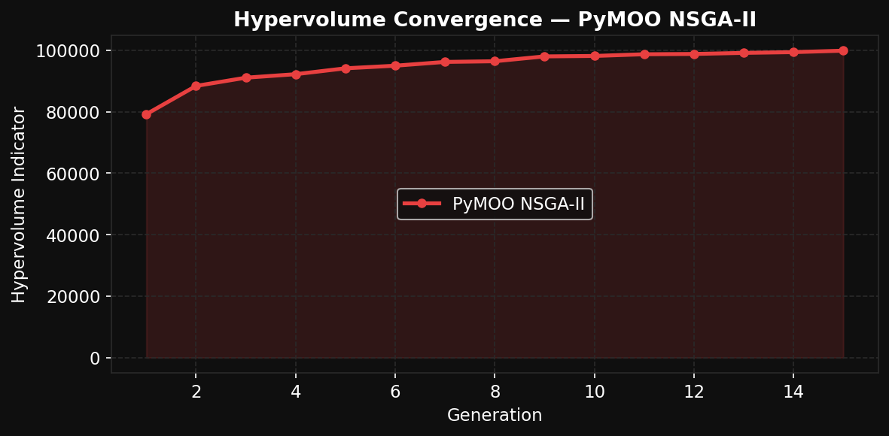

# Multi-Objective Neural Architecture Search on Fashion-MNIST
### Using NSGA-II (PyMOO + Optuna) — 3 Objectives: Accuracy · Inference Time · Model Size

> **Course Assignment** | Application 1: Image Classification  
> **Authors:** Vrajnandak Nangunoori (IMT2022527) · Dikshant Mahawar (IMT2022549)

---

## Overview

Deploying image classifiers on resource-constrained devices demands simultaneously optimising competing objectives — a highly accurate model is rarely the smallest or fastest. This project applies **NSGA-II (Non-Dominated Sorting Genetic Algorithm II)** via two frameworks (**PyMOO** and **Optuna**) to perform neural architecture search (NAS) on **Fashion-MNIST**, characterising the full Pareto trade-off surface rather than finding a single "best" model.

### The Three Objectives (optimised simultaneously)
| # | Objective | Direction |
|---|-----------|-----------|
| 1 | Classification Accuracy (Top-1 %) | Maximise |
| 2 | Per-sample Inference Time (ms) | Minimise |
| 3 | Total Trainable Parameters (K) | Minimise |

---

## Repository Structure

```
Fashion_MNIST/
├── README.md
├── momlfinal.ipynb           # Main notebook — full MOO loop, training, evaluation
├── images/
│   ├── plot1_3d_pareto_pymoo.png          # 3-D Pareto front — PyMOO NSGA-II
│   ├── plot2_3d_pareto_optuna.png         # 3-D Pareto front — Optuna NSGAIISampler
│   ├── plot3_2d_tradeoffs_comparison.png  # Pairwise 2-D trade-off scatter plots
│   ├── plot4_parallel_coords.png          # Parallel coordinates — both algorithms
│   └── plot5_hypervolume.png              # Hypervolume convergence over generations
└── results/
    ├── algorithm_comparison.csv           # Head-to-head quantitative metrics table
    ├── pareto_pymoo.csv                   # Full 23-point PyMOO Pareto front
    ├── pareto_optuna.csv                  # Full 8-point Optuna Pareto front
    ├── pareto_4_points_comparison.csv     # 4 selected combined Pareto points
    ├── pareto_4_points_pymoo.csv          # 4 selected PyMOO Pareto points
    ├── pareto_4_points_optuna.csv         # 4 selected Optuna Pareto points
    └── spacing_table.csv                  # Spacing metric results
```

---

## Algorithm: NSGA-II

NSGA-II drives the search via three core mechanisms:

1. **Non-Dominated Sorting** — the population is stratified into Pareto fronts; solutions on Front 1 are not dominated by any other solution.
2. **Crowding Distance** — within each front, isolated solutions are preferred during selection, ensuring diversity across the trade-off surface.
3. **Elitism** — the best solutions from each generation are guaranteed to survive into the next.

Each generation applies **Simulated Binary Crossover** (SBX, η=15, p=0.9) and **Polynomial Mutation** (η=20) to generate offspring, then merges parent + offspring pools (size 2N) and selects the top N by rank and crowding distance.

---

## Search Space (Decision Variables)

| Variable | Range | Type |
|----------|-------|------|
| Conv. layers | [1, 3] | Integer |
| Base channels | {16, 32, 64} | Categorical |
| FC hidden units | {64, 128, 256} | Categorical |
| Learning rate | [1e-4, 1e-2] | Continuous (log scale) |
| Batch size | {32, 64, 128} | Categorical |
| Epochs | [5, 10] | Integer |
| Dropout | [0.0, 0.5] | Continuous |
| Optimizer | {Adam, SGD} | Categorical |

---

## Results Summary

| Metric | PyMOO NSGA-II | Optuna NSGAIISampler |
|--------|--------------|----------------------|
| Pareto Front Size | **23** | 8 |
| Total Evaluations | 375 | 60 |
| Wall Time | 179.4 min | **21.1 min** |
| Hypervolume (↑) | **99,875** | 15,913 |
| Spacing Metric (↓) | **0.2097** | 0.2222 |
| Best Accuracy | **90.78%** | 90.40% |
| Fastest Inference | **0.221 ms** | 0.228 ms |
| Smallest Model | 106.0 K | 106.0 K |

### Key Pareto Points

| Point | Accuracy | Infer Time | Params | Recommended For |
|-------|----------|-----------|--------|-----------------|
| P1 — Best Acc (PyMOO) | 90.78% | 0.936 ms | 879.1 K | Unconstrained / server |
| P2 — Fastest (PyMOO) | 87.68% | 0.221 ms | 201.6 K | Hard latency budgets |
| P3 — Smallest (Optuna) | 90.40% | 0.394 ms | **106.0 K** | Cloud / memory-constrained |
| P4 — Knee (Optuna) | 88.26% | 0.233 ms | 201.6 K | **Edge / mobile deployment** |

> **Highlighted finding:** Optuna P3 achieves 90.40% accuracy with only 106K parameters — just 0.38 pp behind PyMOO's best, while being **8.3× smaller** and **2.4× faster**.

---

## Plots

| Figure | Description |
|--------|-------------|
|  | **Fig 1** — 3-D Pareto front (PyMOO). 23 solutions spanning the full accuracy–latency–size space. |
|  | **Fig 2** — 3-D Pareto front (Optuna). 8 solutions in a narrower region, reflecting the smaller trial budget. |
|  | **Fig 3** — Pairwise 2-D trade-offs: Accuracy vs. Infer Time, Accuracy vs. Params, Infer Time vs. Params. |
|  | **Fig 4** — Parallel coordinates. PyMOO's crossing lines show genuine multi-objective trade-offs; Optuna's near-parallel lines reflect narrower exploration. |
|  | **Fig 5** — Hypervolume convergence over 15 generations. Rises from ~80,000 (Gen 1) to ~100,000 (Gen 15). |

---

## Setup & Reproduction

### Requirements

```bash
pip install torch torchvision pymoo optuna numpy pandas matplotlib
```

### Run

Open and execute `momlfinal.ipynb` top-to-bottom. The notebook is self-contained:
- Downloads Fashion-MNIST automatically via `torchvision`
- Runs the PyMOO NSGA-II loop (375 evaluations, ~3 hrs on T4 GPU)
- Runs the Optuna NSGAIISampler loop (60 trials, ~21 min)
- Saves all CSVs to `results/` and all plots to `images/`

> **Note:** PyMOO wall time is ~179 min. Set `n_gen=5` for a quick smoke test.

### Reproducibility

All experiments use fixed random seeds. The training subset (20,000 samples) and validation subset (5,000 samples) are fixed across all evaluations for fair comparison. Fashion-MNIST images are normalised to mean 0.286, std 0.353.

---

## Conclusion

NSGA-II successfully characterises the three-way trade-off between accuracy, inference time, and model size for CNN classifiers on Fashion-MNIST. Key takeaways:

- A **9.7× increase in model size** yields only ~1.86 pp more accuracy (strong diminishing returns).
- The **fastest model** (5.1× faster) sacrifices only 2.94 pp accuracy — excellent for latency-critical applications.
- **Inference time and parameter count are not interchangeable** — both must be measured independently.
- The **knee-point solution** (88.26% accuracy, 0.233 ms, 201.6K params) is the recommended balanced deployment choice for edge/mobile scenarios.

---

## References

- Deb, K., et al. (2002). *A Fast and Elitist Multiobjective Genetic Algorithm: NSGA-II*. IEEE Trans. Evolutionary Computation.
- [PyMOO Documentation](https://pymoo.org/)
- [Optuna Documentation](https://optuna.org/)
- [Fashion-MNIST Dataset](https://github.com/zalandoresearch/fashion-mnist)

